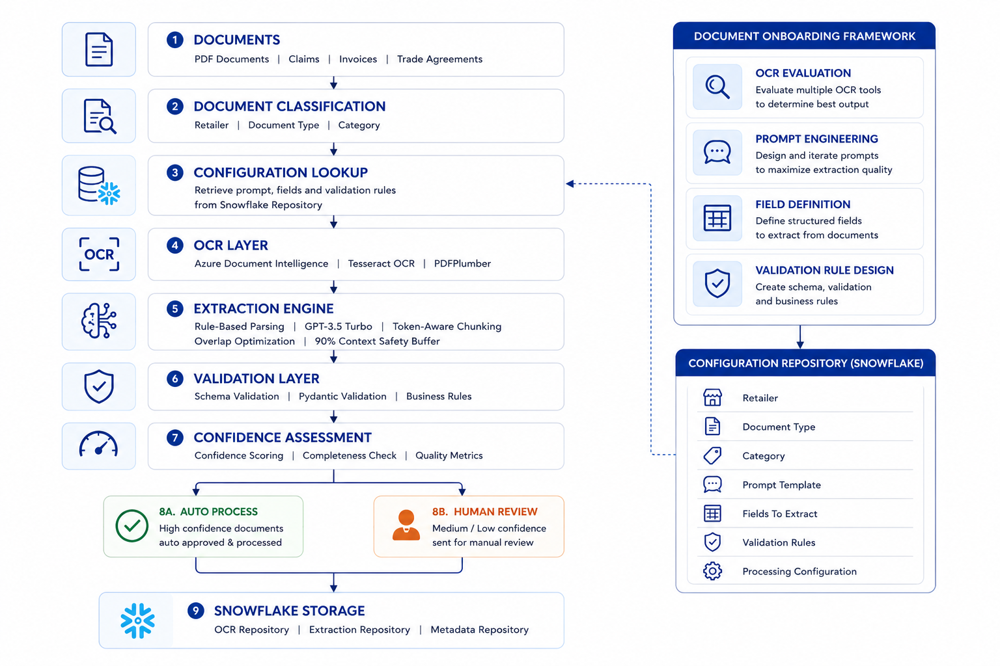
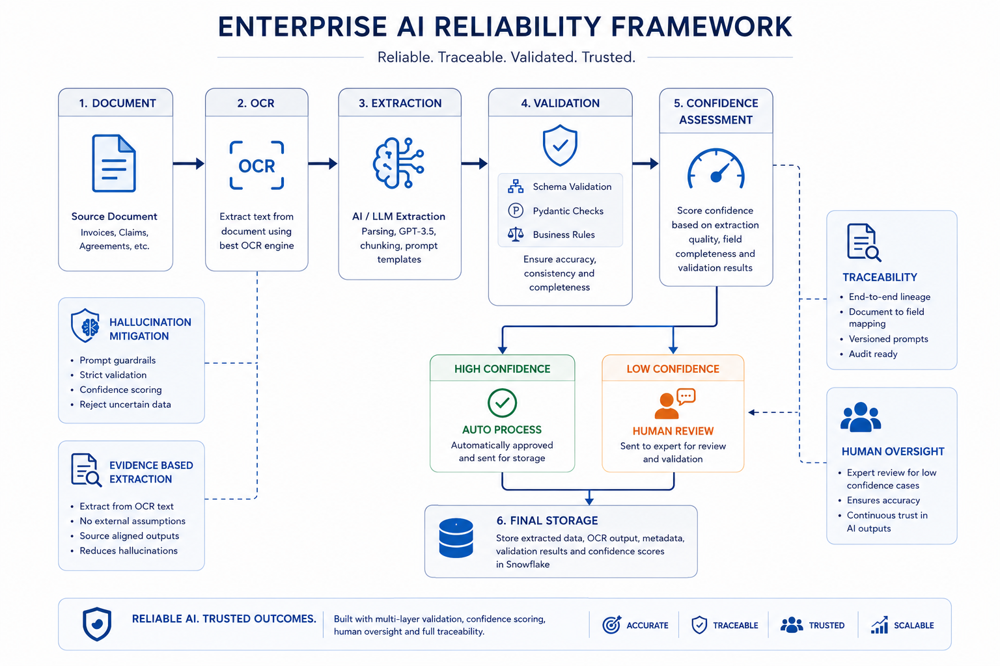
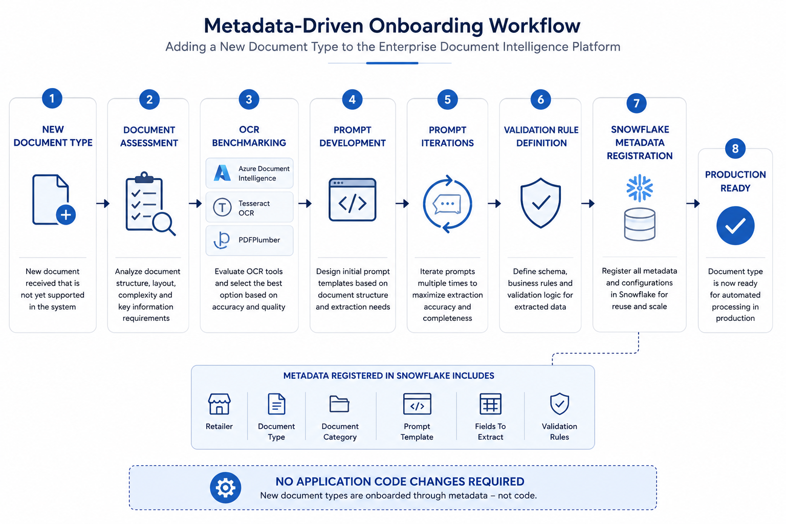
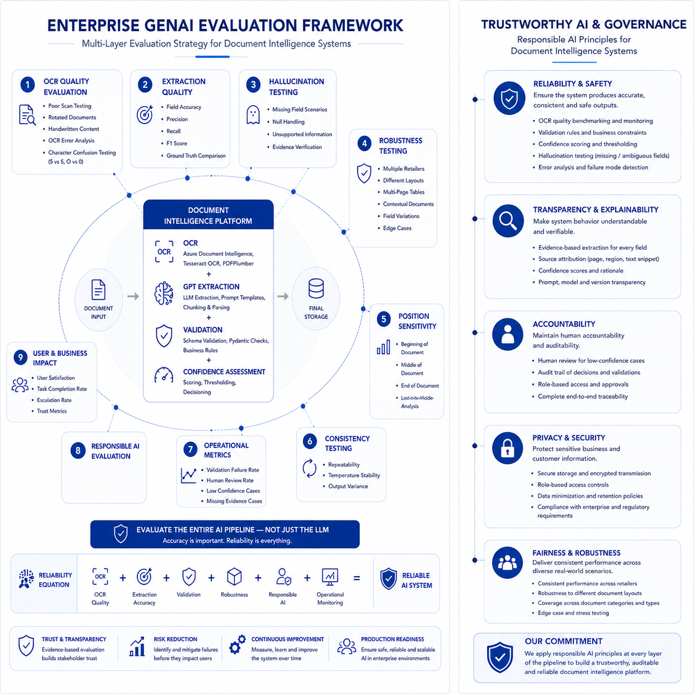

# Enterprise Document Intelligence Platform

## Overview

This repository presents a case study of an enterprise-scale Document Intelligence Platform designed to automate extraction, validation, and review workflows for highly variable business documents.

The platform combines OCR technologies, Large Language Models (LLMs), metadata-driven configuration, validation frameworks, and human-in-the-loop review processes to reduce manual effort while improving reliability, scalability, and business outcomes.

The solution was inspired by a real-world enterprise document-processing initiative and has been generalized to remove all proprietary information, confidential business logic, and company-specific details.

---

# Business Problem

Large enterprises often process thousands of documents such as:

* Claims
* Invoices
* Trade Agreements
* Contracts
* Promotional Documents
* Settlement Forms

These documents frequently require manual review before business decisions can be made.

Typical challenges include:

* Different layouts across business partners
* Poor-quality scans
* Handwritten content
* Multi-page tables
* Missing headers
* Semantic variability
* Multiple contracts within a single document

Manual review workflows can be slow, inconsistent, and difficult to scale.

In this case study, more than 250 business users were involved in reviewing and validating documents, with processing times averaging approximately 20 minutes per document.

The objective was to reduce manual effort, improve validation quality, and reduce financial leakage risk.

---

# Solution Architecture

The platform uses a metadata-driven architecture that separates document-specific behavior from application code.

Rather than hardcoding extraction logic for every document variation, the system dynamically retrieves extraction rules, prompts, and validation requirements from a centralized metadata repository.



Key capabilities include:

* OCR-based text extraction
* Context-aware field extraction using LLMs
* Dynamic prompt selection
* Validation and business rule enforcement
* Confidence-based human review
* Enterprise-scale traceability and monitoring

Detailed architecture documentation is available in:

```text
docs/04_architecture.md
```

---

# Metadata-Driven Onboarding

A key differentiator of the platform is metadata-driven onboarding.

New document types are onboarded through configuration rather than code changes, allowing the platform to scale across retailers, document categories, and document types.



Metadata stored in Snowflake includes:

* Retailer
* Document Type
* Document Category
* Prompt Templates
* Fields To Extract
* Validation Rules
* Processing Configuration

This enables new document types to be added without modifying application code.

---

# Key Challenges Addressed

## Document Variability

The platform was designed to handle:

* Scanned PDFs
* Blurry documents
* Rotated documents
* Handwritten annotations
* Multi-page tables
* Tables without repeated headers
* Multiple contracts in a single PDF
* Multiple tables within a document

---

## Semantic Variability

The same business field may appear under different labels.

Examples:

```text
PO Number
PO No
PO #
Purchase Order Number
```

Traditional rule-based extraction approaches often struggle with these variations.

The use of LLMs enables contextual understanding rather than relying solely on fixed field names or coordinates.

---

## Large Document Processing

Many documents exceeded LLM context limits.

The platform implemented:

* Token-aware chunking
* Overlap optimization
* Response consolidation
* 90% context-window safety buffers

to maintain extraction quality across large documents.

---

# Key Engineering Decisions

## Metadata-Driven Design

Document-specific logic was externalized into Snowflake metadata rather than embedded within application code.

---

## Hybrid Extraction Strategy

Not every document requires an LLM.

The platform uses:

* OCR
* Traditional parsing techniques
* Open-source document libraries
* LLM-based extraction

depending on document complexity.

This improves:

* Cost efficiency
* Processing speed
* Scalability

---

## OCR Traceability

OCR outputs are stored separately from extraction outputs.

This enables:

* Root-cause analysis
* Error attribution
* Continuous improvement

---

## Reliability-First Design

The platform prioritizes reliability over raw automation.

Controls include:

* Structured outputs
* Validation layers
* Pydantic checks
* Human review workflows
* Confidence assessment

---

# Reliability Framework

The platform emphasizes reliability through validation, confidence scoring, traceability, hallucination mitigation, and human review workflows.



Reliability controls include:

* Schema Validation
* Pydantic Validation
* Business Rule Validation
* Confidence Assessment
* Human Review
* Traceability
* Evidence-Based Extraction

---

# Evaluation Framework

The solution was evaluated across multiple dimensions:

* OCR Evaluation
* Extraction Evaluation
* Consistency Evaluation
* Reliability Evaluation
* Hallucination Evaluation
* Robustness Testing
* Failure Mode Analysis
* Business Impact Assessment

The objective was understanding not only when the system succeeds, but also when and why it fails.



The evaluation framework emphasizes:

* Reliability
* Robustness
* Trustworthiness
* Responsible AI
* Operational Readiness

rather than focusing solely on model accuracy.

---

# Hallucination Mitigation

Hallucination risk was treated as a system-level problem rather than a prompt-engineering problem.

Mitigation strategies included:

* Temperature = 0
* Structured outputs
* Explicit NULL handling
* Validation layers
* Human review workflows
* OCR evidence verification

The objective was ensuring extracted values were supported by document evidence before downstream consumption.

---

# Business Impact

## Operational Impact

Reduced document validation effort from approximately:

```text
~20 Minutes
```

to:

```text
< 2 Minutes
```

per document.

---

## Financial Impact

Projected annual savings exceeding:

```text
$19 Million
```

through improved efficiency and reduced manual effort.

---

## Platform Impact

The solution evolved into a reusable enterprise capability supporting:

* Faster onboarding
* Reduced maintenance effort
* Improved scalability
* Lower operational costs

---

# Repository Structure

```text
enterprise-document-intelligence-platform/

├── README.md

├── docs/
│   ├── 01_executive_summary.md
│   ├── 02_business_problem.md
│   ├── 03_solution_overview.md
│   ├── 04_architecture.md
│   ├── 05_key_engineering_decisions.md
│   ├── 06_scalability.md
│   ├── 07_evaluation_framework.md
│   ├── 08_reliability_and_guardrails.md
│   ├── 09_responsible_ai.md
│   ├── 10_production_engineering.md
│   ├── 11_business_impact.md
│   ├── 12_lessons_learned.md
│   ├── 13_future_enhancements.md
│   └── 14_failure_modes_and_risk_analysis.md

├── diagrams/
│   ├── technical_architecture.png
│   ├── metadata_driven_onboarding.png
│   ├── reliability_framework.png
│   └── genai_evaluation_framework.png

└── presentation/
```

---

# Skills Demonstrated

### AI & Machine Learning

* Generative AI
* Prompt Engineering
* LLM Evaluation
* Responsible AI

### Document Intelligence

* Azure Document Intelligence
* OCR Evaluation
* Tesseract OCR
* PDFPlumber
* Information Extraction

### Data Engineering

* Snowflake
* Metadata Management
* Data Validation
* Data Traceability

### Software Engineering

* Python
* CI/CD
* Automated Testing
* Logging
* Error Handling
* Production Readiness

### Enterprise Architecture

* Metadata-Driven Design
* Human-in-the-Loop Systems
* Reliability Engineering
* Observability
* Scalable Platform Design

---

# Future Enhancements

Potential future enhancements include:

* Automated Document Classification
* Advanced Confidence Scoring
* Retrieval-Augmented Generation (RAG)
* Cross-Document Validation
* Enterprise Search
* Agentic Document Intelligence

Additional details are available in:

```text
docs/13_future_enhancements.md
```

---

# Disclaimer

This repository is intended for educational and portfolio purposes.

All company-specific references, proprietary implementations, confidential business logic, sensitive data, and internal documentation have been removed or generalized.

The focus of this repository is demonstrating architecture, engineering decisions, evaluation methodologies, scalability patterns, reliability frameworks, and lessons learned from building an enterprise document intelligence platform.
