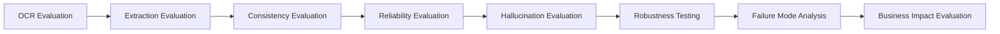

# Evaluation Framework

```mermaid
flowchart LR

A[OCR Evaluation]

A --> B[Extraction Evaluation]

B --> C[Consistency Evaluation]

C --> D[Reliability Evaluation]

D --> E[Hallucination Evaluation]

E --> F[Robustness Testing]

F --> G[Failure Mode Analysis]

G --> H[Business Impact Evaluation]
```