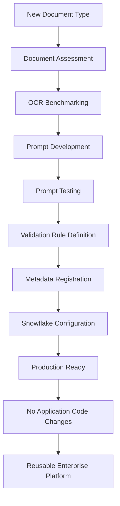

# Metadata Driven Onboarding

```mermaid
flowchart TD

A[New Document Type]

A --> B[Document Assessment]

B --> C[OCR Benchmarking]

C --> D[Prompt Development]

D --> E[Prompt Testing]

E --> F[Validation Rule Definition]

F --> G[Metadata Registration]

G --> H[Snowflake Configuration]

H --> I[Production Ready]

I --> J[No Application Code Changes]

J --> K[Reusable Enterprise Platform]
```