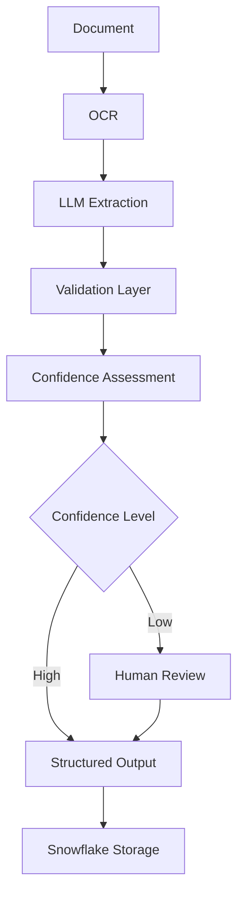

# Reliability and Guardrails

```mermaid
flowchart TD

A[Document]

A --> B[OCR]

B --> C[LLM Extraction]

C --> D[Validation Layer]

D --> E[Confidence Assessment]

E --> F{Confidence Level}

F -->|High| G[Structured Output]

F -->|Low| H[Human Review]

H --> G

G --> I[Snowflake Storage]
```