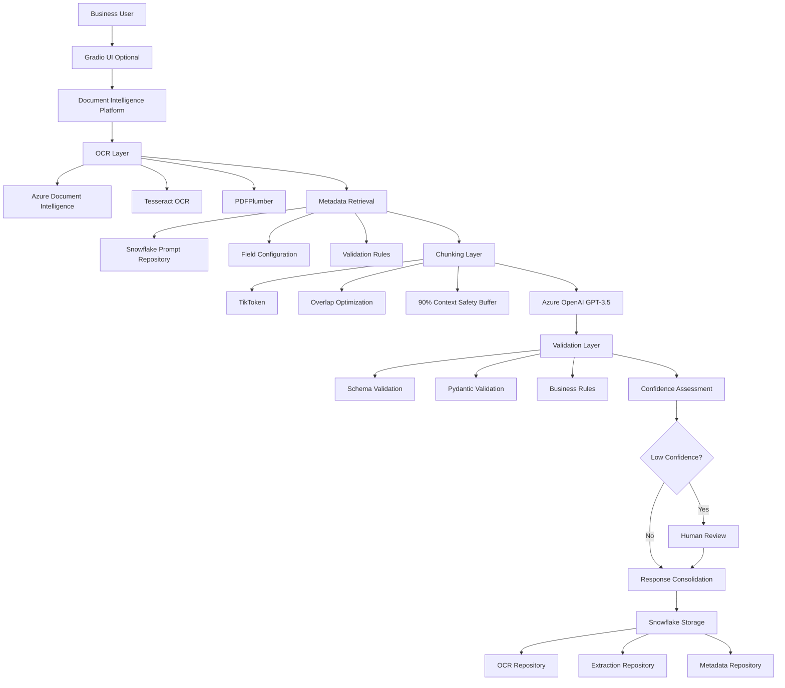

# Technical Architecture

```mermaid
flowchart TD

A[Business User]

A --> B[Gradio UI Optional]

B --> C[Document Intelligence Platform]

C --> D[OCR Layer]

D --> D1[Azure Document Intelligence]
D --> D2[Tesseract OCR]
D --> D3[PDFPlumber]

D --> E[Metadata Retrieval]

E --> E1[Snowflake Prompt Repository]
E --> E2[Field Configuration]
E --> E3[Validation Rules]

E --> F[Chunking Layer]

F --> F1[TikToken]
F --> F2[Overlap Optimization]
F --> F3[90% Context Safety Buffer]

F --> G[Azure OpenAI GPT-3.5]

G --> H[Validation Layer]

H --> H1[Schema Validation]
H --> H2[Pydantic Validation]
H --> H3[Business Rules]

H --> I[Confidence Assessment]

I --> J{Low Confidence?}

J -->|Yes| K[Human Review]

J -->|No| L[Response Consolidation]

K --> L

L --> M[Snowflake Storage]

M --> M1[OCR Repository]
M --> M2[Extraction Repository]
M --> M3[Metadata Repository]
```